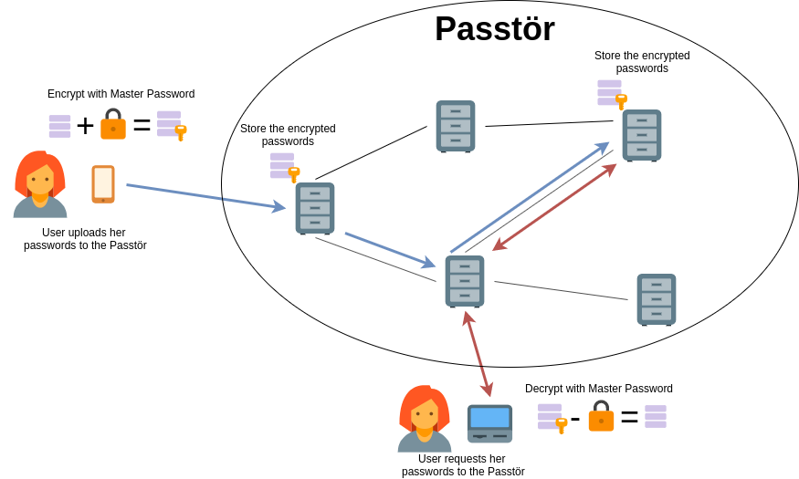

# Passtör (Decentralized Password Manager)

Authors: Cedric Maire, Guillaume Michel, Xavier Pantet

## Project design

Our systems goal is to provide a resilient and reliable password manager as simple as possible. This is achieved by building a distributed and decentralized system powered by a Distributed Hash Table (DHT), ensuring high avaiability and resilience.

Users only have to remember their username and master password. We assume that the master password will never be lost and is strong enough to resist traditional brute-force or dictionary attacks. The client's symmetric key derived from the master password, using Argon2, a Key Derivative Function (KDF). The user's passwords are encrypted with ChaCha20, using the generated key, and stored in the DHT. The user can fetch the passwords at anytime from any device, and decrypt the passwords. The encrypted passwords are available to anyone to download, but only the user with the knowledge of the master secret will be able to decrypt it.

Passtör uses a DHT taking inspiration from the famous Kademlia DHT [1], and allows replication of encrypted data with a replication factor specific for each user account. The data associated with each user account is distributed in the DHT, thus each node only needs to store *( #accounts \* repl / #nodes )* accounts on average, *repl* being the constant average replication factor. Thus the required storage capacity is linear in the number of registered accounts per node which scales well with a large number of nodes.

Our DHT follows Kademlia design with XOR distance, and its buckets follow a least-recently seen eviction policy, except that nodes answering to periodic ping requests are never removed from the list. Our system provides strong consistency. Each update overrides the previous version of the data, thus there is no stale data in the system. To join the DHT, a new node only needs to know the address of at least another peer already in the DHT.

The full specifications can be found [here](resources/specifications.pdf).




## Files

- ### [client/](client)

This folder contains the client implementation. To launch the client, just type:
```
go build
./client
````

- ### [server/](server)

This folder contains the passtor (dht node) implementation. The server should be used as follow:

```
Usage of ./server:
  -addr string
    	address used to communicate other passtors instances (default "127.0.0.1:5000")
  -name string
    	name of the Passtor instance
  -peers string
    	bootstrap peer addresses
  -v int
    	verbose mode (default 1)
```

To test our program it is recommended to run at least 5 passtor instances.

- ### [scripts/](scripts)

Contains scripts that automatically launch multiple instances of passtors.

- ### [tests/](tests)

Contains a few tests we created for the project.

- ### System constants

All system constants are defined in [const.go](const.go).

## How to run this project

To run this project you can run the following code:

```
git clone https://github.com/guillaumemichel/passtor
cd passtor
go build
```

Then you need to launch multiple [passtor](server/server.go) instances to start the system. Once it is done, you can connect to any passtor instance with the [client](client/client.go), and create an account, store, modify and download your credentials.

## References
[1] P. Maymounkov and D. Mazieres, “Kademlia: A peer-to-peer information system based on the xor metric,” Peer-to-Peer Systems, pp. 53–65, 2002.